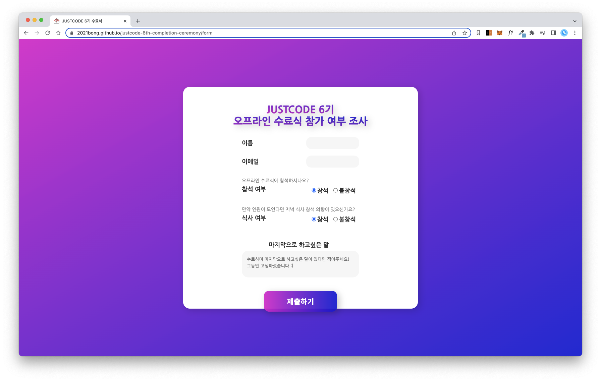
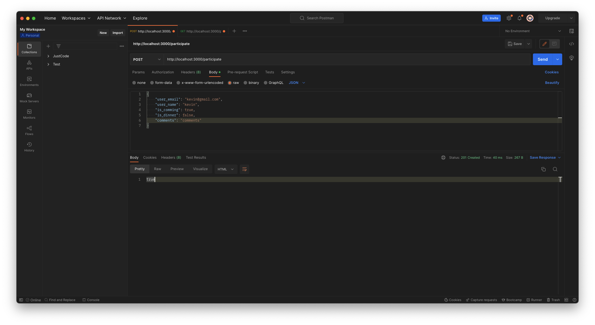
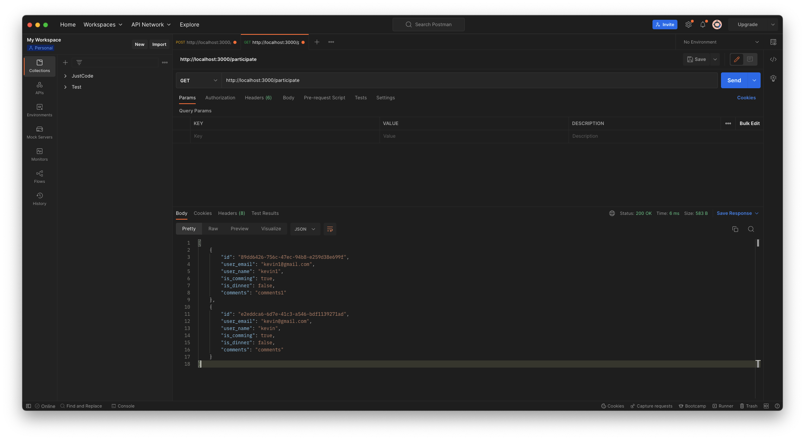

# participants-nest-justcode

> NestJS로 간단한 기능을 구현하여 전체적인 구조 파악과 흐름을 이해하기 위한 목적으로 만들어진 프로젝트입니다. 간단하게 구현하고자 하는 내용은 [Justcode 수료식 참여 인원 파악 프로젝트](https://github.com/2021bong/justcode-6th-completion-ceremony)에 필요한 API 입니다.
> 

## 🚀 프로젝트 구성 과정

**Nest CLI 설치** :

```shell
npm install -g @nestjs/cli
nest new [프로젝트명]
```

**Nest 초기 프로젝트 구조** :

```
- dist : 서버 실행시 폴더 하위에 컴파일된 스크립트들이 위치
- src
  - app.controller.spec.ts : 단위 테스트 파일
  - app.controller.ts : 컨트롤러 파일
  - app.module.ts : 모듈 정의 파일
  - app.service.ts : 서비스 파일
  - main.ts : 서버 실행 파일
- nest-cli.json : 프로젝트 Root 경로 설정 파일
- tsconfig.build.json : 컴파일시 ignore 설정 파일
- tsconfig.json : 타입스크립트 환경설정 파일
```

**Nest 모듈 생성** :

프로젝트 `src` 폴더 하위에서는 `app.module.ts`와 `main.ts`를 제외하고 작업을 진행했습니다.

```shell
nest g module [모듈명]
```

**Nest 컨트롤러 생성** :

`--no-spec` 옵션을 지정할 경우 `*.controller.spec.ts` 파일 없이 컨트롤러를 생성합니다.

```shell
nest g controller [모듈명] --no-spec
```

**Nest 서비스 생성** :

`--no-spec` 옵션을 지정할 경우 `*.controller.spec.ts` 파일 없이 서비스를 생성합니다.

```shell
nest g service [모듈명] --no-spec
```

**Nest 서버 실행** :

서버 실행 후 `http://localhost:3000/user`로 접속하면 test 문구를 확인할 수 있습니다.

```shell
npm run start:dev
```

**Nest dto 유효성 검사** :

Nest에서 지원하는 미들웨어 Pipe를 이용하여 유효성 검사를 진행할 수 있습니다.

```shell
npm install class-validator class-transformer
```

Pipe에는 Global, Handler, Parameter 레벨별로 분리되며, Nest에서는 기본적으로 8개의 Pipe를 지원합니다. (관련된 옵션들은 [공식 홈페이지](https://docs.nestjs.com/techniques/validation) 참고)

- ValidationPipe
- ParseIntPipe
- ParseFloatPipe
- ParseBoolPipe
- ParseArrayPipe
- ParseUUIDPipe
- ParseEnumPipe
- DefaultValuePipe

**Nest Middleware 추가** :

추가하고자 하는 미들웨어를 정의하고 `app.module.ts`에 등록했습니다.

**Nest TypeORM** :

`@EntityRepository` Deprecated 문제가 있어, `@CustomRepository` 등록 후 사용했습니다. (자세한 내용은 [블로그](https://velog.io/@pk3669/typeorm-0.3.x-EntityRepository-%EB%8F%8C%EB%A0%A4%EC%A4%98) 참고)

```shell
npm install mysql2 typeorm @nestjs/typeorm
```

## 🚀 구현 결과




## 🚀 참고

- https://any-ting.tistory.com/category/%EB%B0%B1%EC%95%A4%EB%93%9C%28Back-End%29/Nest.js
